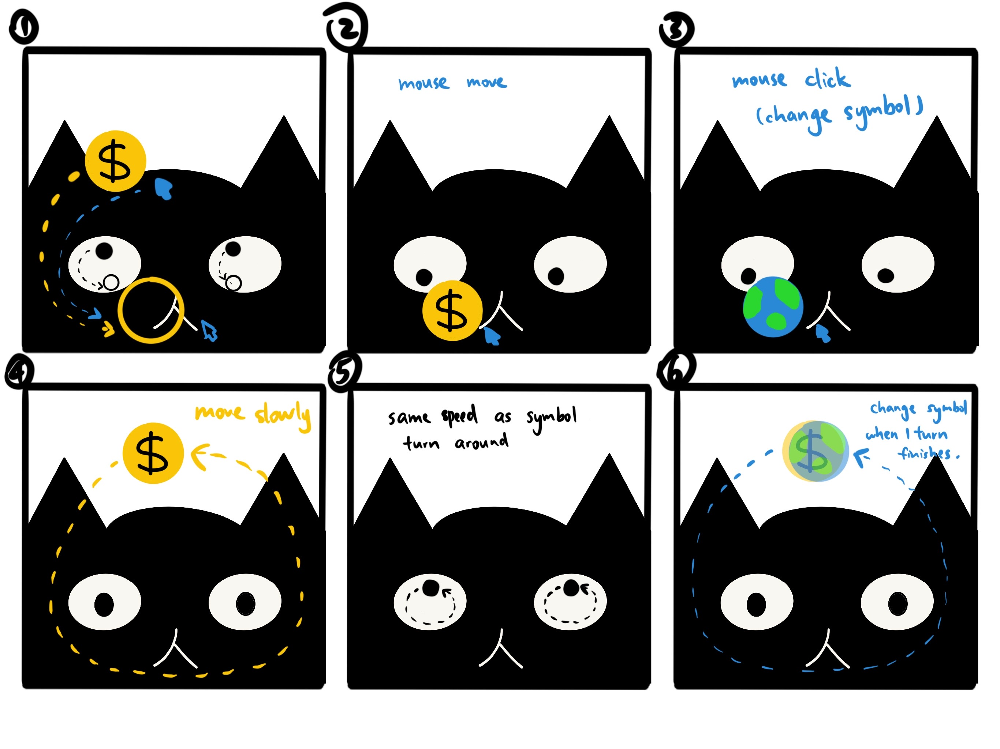

## Book
I chose the book "*I AM A CAT*" written by *Soseki Natsume* who is a Japanese novelist. The story is narrated from the perspective of an unnamed cat, who observes and comments on the lives and behaviors of the people around him. The cat lives in the home of a teacher and his family in Tokyo during the Meiji era, a period of significant social and cultural change in Japan. It offers a unique and often amusing perspective on the human condition, seen through the eyes of a cat who is simultaneously an astute observer and an outsider to the human world. While the novel is primarily a satire and a social commentary, it explores various themes, including:
- Observation of Human Behavior
- Social Critique
- Loneliness and Alienation
- Identity and Self-Reflection
- Humor and Irony

## Ideas
I will include the main character cat in my cover, and also some symbols of elements the book mentioned, for example: money, social status, unity... 
The cat's eyes are the key point for interactive, they will keep moving, just like the cat in the book who is always observing its surroundings. But as the mouse moves, the cat's eyes will follow the movement of the mouse to pursue some symbols that pop up. The symbols will change when the mouse clicks.
It can be both interactive and time based, if the mouse doesn't move/click, it will change slowly by itself based on time. But when someone moves/clicks the mouse, it will follow the mouse action.

I want to use some symbols to represent abstract concepts, just like the reading in week3 "*Glitch Feminism: A Manifesto*", the author used "glitches" in technology as a metaphor for the imperfections and biases in our society. I researched about symbols and metaphors in geometric shapes, for example: 
- Fist Raised in Solidarity = unity and strength
- Peace Symbol = harmony in society
- Key Symbol = the quest for justice and equal access to resources
- Globe or Earth Symbol = interconnectedness of social justice issues
- Bicycle Wheel = sustainable and equitable mobility

## Sketches
Here are some sketches that show my ideas directly.

01-03 show the movement when mouse moves/clicks.
04-06 show the movement without interaction.

